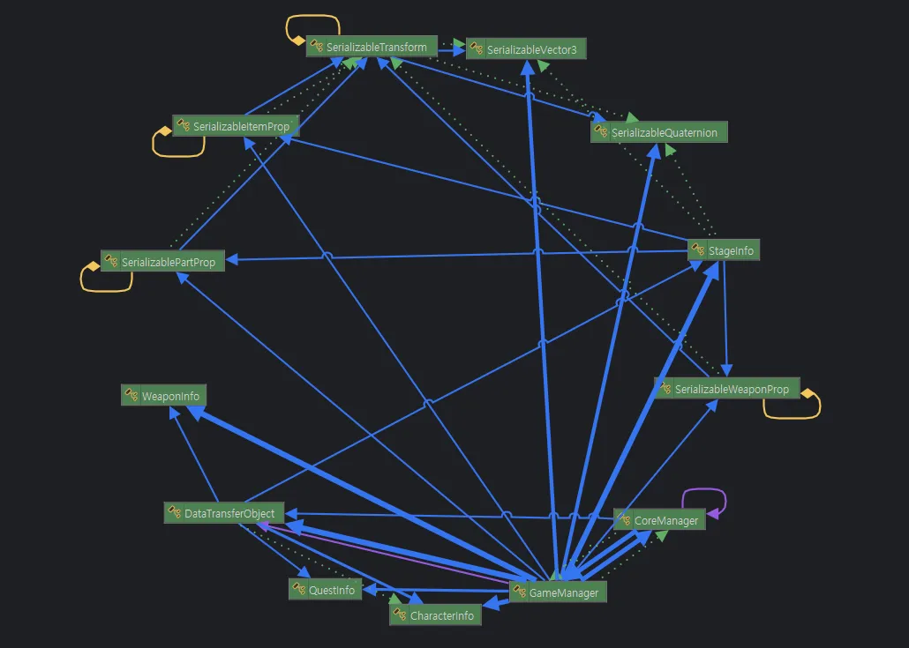

# 👩‍💻 Save & Load

| 클래스 | 설명 |
|--------|------|
| CoreManager | 게임매니저의 비동기 저장 메서드를 안전하게 관리하며 실행시킵니다. |
| GameManager | DataTransferObject 클래스를 활용하여 현재 게임을 저장합니다. |
| DataTransferObject | 저장해야하는 모든 정보를 담은 클래스입니다. |
| 이외 | DataTransferObject 내의 저장할 목록들입니다. |