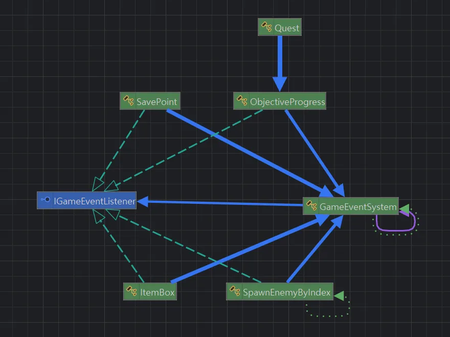

# 👩‍💻 UI

 

| 클래스 | 설명 |
|--------|------|
| GameEventSystem | 게임 내의 모든 IGameEventListener를 통합 관리합니다. (생성, 해제, 호출) |
| 이외 | 이벤트 발생이 필요한 객체(퀘스트, 스포너, 세이브포인트, 아이템박스)는 IGameEventListener를 상속받고 GameEventSystem에 본인을 등록합니다. |

 

---