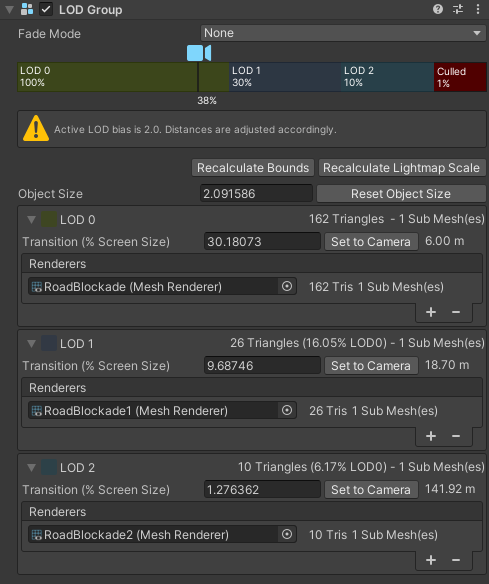
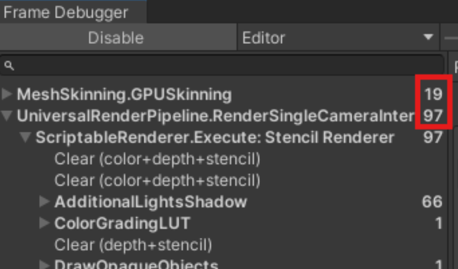
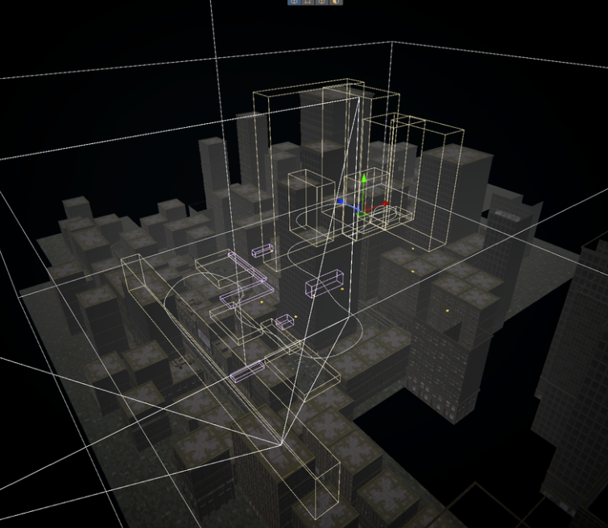
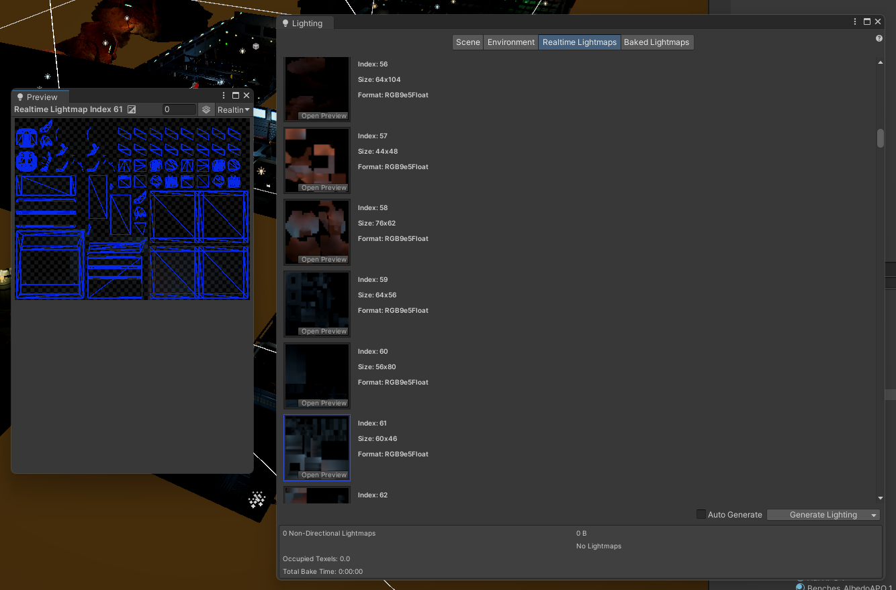

# 🛠️ 최적화 (Optimization)

## 목차

- [🌙 OverView 🌙](#overview)
- [🎨 렌더링 🎨](#rendering-optimization)
- [🧠 메모리 🧠](#memory-optimization)

---

 

## 🌙 OverView

현 페이지에선 최적화에 적용된 기술 스택을 소개합니다.  
렌더링과 메모리의 관점을 분리해 소개하겠습니다.

 

---

 

## 🎨 Rendering Optimization

| 기술명               | 개요                               |
|----------------------|----------------------------------|
| **Occlusion Culling** | 보이지 않는 오브젝트는 렌더링하지 않아 GPU 부하 감소  |
| **LOD Group**         | 거리별 서로 다른 디테일 모델 전환으로 성능과 품질 균형  |
| **Static Batching**   | 움직이지 않는 오브젝트를 묶어 Draw Call 감소    |
| **Reflection Probe**   | 씬 내의 환경 반사를 캡처해 저장 후 반사 적용       |
| **Light Baking**   | 씬 내의 조명을 미리 계산하여 텍스처로 저장 후 조명 적용 |

 

### 기술별 상세 설명

---

#### Occlusion Culling

카메라 시야에 들어오지 않는 오브젝트를 렌더링하지 않는 기술입니다.  
이를 통해 GPU는 화면에 보이지 않는 객체를 처리하지 않아도 되어 성능이 크게 향상됩니다.

특히 복잡한 씬에서 매우 효과적이며, 불필요한 렌더링 비용을 줄여 프레임 유지에 도움을 줍니다.

 

#### LOD Group

오브젝트와 카메라 거리별로 디테일 수준(LOD)을 자동으로 조절하는 기능입니다.  
가까운 오브젝트는 고해상도 모델로 표시되고, 멀리 있는 오브젝트는 저해상도 모델로 대체되어 렌더링 부하를 줄입니다.

이 기술은 시각적 품질과 성능 사이의 균형을 맞추는 데 유용합니다.

 

#### Static Batching

정적인(움직이지 않는) 오브젝트들을 하나의 배치로 묶어 한 번의 Draw Call로 처리하는 방법입니다.  
정적 배칭을 활용하면 GPU가 처리해야 할 렌더링 호출 횟수를 크게 줄일 수 있어,  
특히 많은 수의 정적 오브젝트가 있는 씬에서 효과적입니다.

 

#### Reflection Probe

씬 내의 환경 반사를 캡처해 저장 한 뒤, 반사를 적용시키는 기술입니다.  
실시간으로 모든 환경 반사를 계산하는 비용을 줄일 수 있습니다.

 

#### Light Baking

씬 내의 조명을 미리 계산하여 텍스처로 저장 후, 조명을 적용시키는 기술입니다.  
실시간으로 복잡한 조명 계산을 하지 않고, 미리 계산된 조명 정보를 불러와서 씬을 빠르게 렌더링할 수 있습니다.

 

---

## 🧠 Memory Optimization

| 기술명              | 개요                              |
|---------------------|---------------------------------|
| **Addressables**    | 리소스 비동기 로딩 및 효율적 관리로 메모리 사용 최적화 |
| **Object Pooling**  | 오브젝트 재사용으로 할당/해제 비용 절감          |
| **UniTask**         | 코루틴 대비 메모리 할당과 성능 개선            |

 

### 기술별 상세 설명

---

#### Addressables

Unity의 Addressables 시스템은 리소스를 비동기적으로 로드하고  
필요하지 않을 때 메모리에서 해제하여 메모리 사용량을 최소화합니다.

복잡한 리소스 관리도 단순화되고, 씬 전환 시 불필요한 메모리 누수를 방지하는 데 도움을 줍니다.  
특히 대규모 프로젝트에서 효과적입니다.

관련 스크립트 : [resourceManager](https://github.com/Neronem/TheLastOne_Public/blob/main/Scripts/Manager/Subs/ResourceManager.cs#L15)

 

#### Object Pooling

자주 생성되고 파괴되는 오브젝트를 미리 만들어 두고 재사용하는 기법입니다.  
오브젝트 풀링을 사용하면 메모리 할당과 해제에 따른 오버헤드를 줄이고,  
가비지 컬렉션 발생 빈도를 낮출 수 있어 게임 성능이 안정됩니다.

총알, 적 캐릭터, 이펙트 등 반복 사용되는 오브젝트에 자주 활용됩니다.

관련 스크립트 : [ObjectPoolManager](https://github.com/Neronem/TheLastOne_Public/blob/main/Scripts/Manager/Subs/ObjectPoolManager.cs#L18)

 

#### UniTask

UniTask는 코루틴보다 메모리 할당이 적고,  
C#의 async/await 문법을 활용하여 비동기 작업을 보다 간결하고 효율적으로 작성할 수 있게 해줍니다.

이를 통해 가비지 컬렉션 부담을 줄이고, 코드 가독성과 유지보수성도 크게 향상시킵니다.  
코루틴으로 복잡해질 수 있는 비동기 흐름을 명확하게 표현할 수 있다는 장점도 있습니다.

관련 스크립트 : [HackingProcess](https://github.com/Neronem/TheLastOne_Public/blob/main/Scripts/Entity/Scripts/NPC/StatControllers/Base/BaseNpcStatController.cs#L254)

 

----