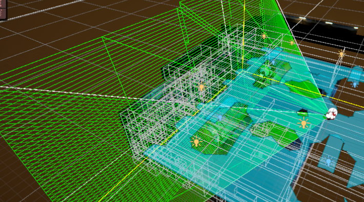

# 🛠️ 적 AI (Enemy AI)

## 목차

- [🌙 OverView 🌙](#overview)
- [🔄 Behavior Tree 🔄](#bt)
---

 

## 🌙 OverView

현 페이지에선 적 AI를 구현하기 위해 적용된 기술 스택을 소개합니다.

 

---

## 🔄 Behavior Tree

### 개념

Behavior Tree는 AI 의사결정을 트리 구조로 계층화하여 관리하는 설계 기법입니다.  
각 노드는 조건 검사나 행동 수행 같은 역할을 담당하며, 트리 구조를 통해 복잡한 의사결정을 모듈화하고 체계적으로 처리할 수 있습니다.

### 도입 이유

- 복잡한 행동 패턴의 모듈화 및 재사용성 향상
- 조건 재평가 주기와 Running 상태 제어를 명확히 하여 자연스러운 행동 전환 구현
- 시각적 툴(Behavior Designer)로 디버깅과 트리 관리 용이

### 주요 메서드 및 기능

| 메서드                                                                                                                                                                 | 기능                                 |
|---------------------------------------------------------------------------------------------------------------------------------------------------------------------|------------------------------------|
| [OnStart](https://github.com/Neronem/TheLastOne_Public/blob/main/Scripts/Entity/Scripts/NPC/AIBehaviors/BehaviorDesigner/Action/ShebotOnly/ShebotRifleFire.cs#L25)  | 노드가 처음 활성화될 때 한 번 호출되며 초기화 작업이나 준비 동작을 처리합니다. |
| [OnUpdate](https://github.com/Neronem/TheLastOne_Public/blob/main/Scripts/Entity/Scripts/NPC/AIBehaviors/BehaviorDesigner/Action/ShebotOnly/ShebotRifleFire.cs#L39) | 노드가 활성 상태인 동안 매 프레임 호출되어 실제 행동 수행과 상태 반환을 담당합니다. |

 

---