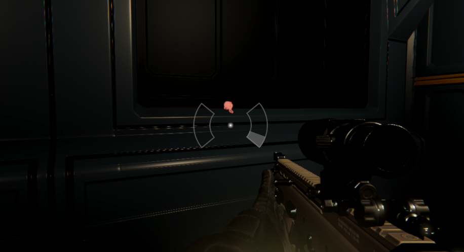

# 🔧 Occlusion Culling과 Stencil Renderer 충돌

## 목차

- [🌙 OverView 🌙](#overview)
- [⚠️ 문제 현상 ⚠️](#problem)
- [🔍 원인 분석 🔍](#search)
- [💡 해결 방법 💡](#solve)

---

 

## 🌙 OverView

카메라 위치와 관계없이 무조건 보이도록 하는것이 Stencil Renderer입니다.

현 페이지에선 Instinct 시스템을 구현하던 중 생긴 문제인  
`Occlusion Culling과 Stencil Renderer 충돌`을 설명합니다.

 

---

 

## ⚠️ 문제 현상
- 벽 너머에 **의도적으로 보여야 하는** Stencil Renderer가 보이지 않음

 

---

 

## 🔍 원인 분석

- [Occlusion Culling 기술스택 바로가기](https://github.com/Neronem/TheLastOne_Public/blob/main/Tech%20Stack/Tech%20Stack%202_Optimization.md#occlusion-culling)

- **Occlusion Culling**은 카메라에서 보이지 않는 객체를 **렌더링하지 않음**
- 따라서 가려진 상태의 Stencil Renderer도 함께 제거됨

 

---

 

## 💡 해결 방법

Dynamic Occlusion 옵션

1. **Mesh Renderer** 설정 열기
2. **Dynamic Occlusion** 옵션을 **Off**로 변경
3. → 카메라에 가려져도 해당 메쉬가 렌더링되도록 변경

 

---
