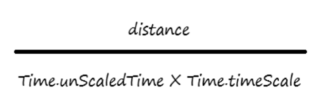
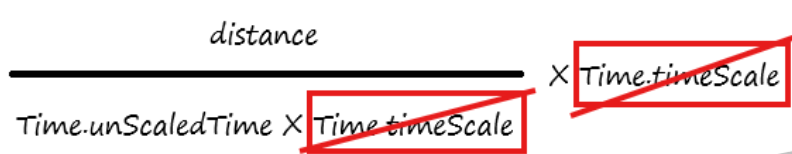

# 🔧 TimeScale 변형 시 캐릭터 속도 증가 버그

## 목차

- [🌙 OverView 🌙](#overview)
- [⚠️ 문제 현상 ⚠️](#problem)
- [🔍 원인 분석 🔍](#search)
- [💡 해결 방법 💡](#solve)

---

 

## 🌙 OverView

현 페이지에선 Focus 시스템을 구현하던 중 생긴 문제인  
`TimeScale 변형 시 캐릭터 속도 증가 버그`을 설명합니다.

 

---

 

## ⚠️ 문제 현상
- TimeScale을 변경하면, Character Controller 컴포넌트 자체의 velocity가 무한대로 빨라짐

 

---

 

## 🔍 원인 분석

  
Time.DeltaTime은 Time.unscaledTime * Time.timeScale입니다.

- velocity의 내부 연산 과정 = (프레임 간 이동한 거리 / Time.DeltaTime)이므로,  
DeltaTime이 갑자기 변경되면 속도에 큰 영향이 가며 무한대로 변함

 

---

 

## 💡 해결 방법

  
Time.timeScale을 곱함으로써 상쇄

- 속도를 결정하는 코드에서 Time.timeScale를 곱함으로써 원래속도로 보정하게 함

 

---
