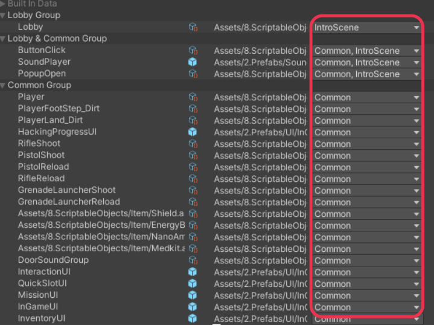

# 🔧 Build시 프리팹의 Material 오류

## 목차

- [🌙 OverView 🌙](#overview)
- [⚠️ 문제 현상 ⚠️](#problem)
- [🔍 원인 분석 🔍](#search)
- [💡 해결 방법 💡](#solve)

---

 

## 🌙 OverView

현 페이지에선 Build 과정 중 생긴 문제인  
`Build시 프리팹의 Material 오류`를 설명합니다.

 

---

 

## ⚠️ 문제 현상
- Editor로 플레이 시 모든 스테이지에서 Material이 깨지지 않고 잘 출력되었음.
- Build 한 작업물을 플레이 해보면 Stage1에서 문제 없던 프리팹들의 Material이 Stage2에서는 깨지는 현상 발생

 

---

 

## 🔍 원인 분석

- [Addressable 기술스택 바로가기](https://github.com/Neronem/TheLastOne_Public/blob/main/Tech%20Stack/Tech%20Stack%202_Optimization.md#addressables)

- 한 가지 Asset에 여러 라벨이 붙어있었음 (Stage1, Stage2)
- 라벨 단위로 로드 및 해제를 수행하는데, Asset이 속한 그룹은 하나
- Stage1 → Stage2 전환 중 로드 및 해제가 그룹 하나를 대상으로 라벨 두개에서 동시에 일어나 충돌이 일어남

 

---

 

## 💡 해결 방법

  
공용은 Common Group

- 공용으로 쓰이는 프리팹들은 Common Group으로 묶어 Common 라벨로 지정
- 특정 스테이지에서 쓰이는 것들은 분리를 해놓으니 Material이 정상적으로 출력됨

 

---
