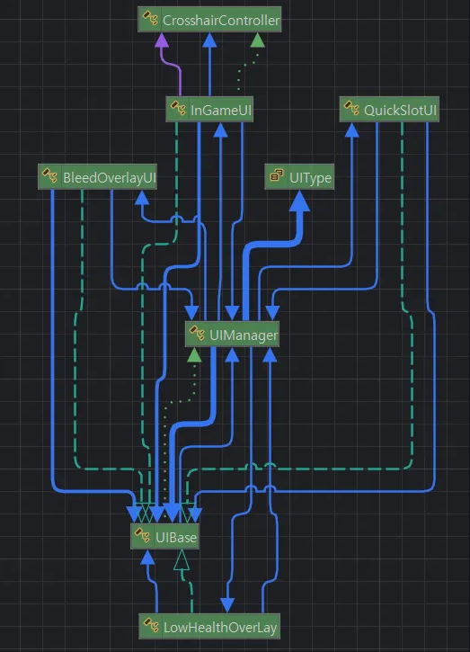

# 🔧 UI 초기화 타이밍 오류

## 목차

- [🌙 OverView 🌙](#overview)
- [⚠️ 문제 현상 ⚠️](#problem)
- [🔍 원인 분석 🔍](#search)
- [💡 해결 방법 💡](#solve)

---

 

## 🌙 OverView

현 페이지에선 UI 제작 중 발생한 오류인  
`UI 초기화 타이밍 오류`를 설명합니다.

 

---

 

## ⚠️ 문제 현상
- 게임을 실행 시, UI마다의 Initialize()가 참조가 끊겨있다는 이유로 제대로 작동하지 않음

 

---

 

## 🔍 원인 분석

- 기존 UI는 InGameUI와 같은 상위 UI가 다수의 하위 UI를 직접 소유/초기화/표시 및 숨김까지 담당하는 구조
- 만약 다른곳에서 InGameUI를 참조한 후에 Initialize()가 실행된다면, **오류 발생**
- 순서가 명시적이지 않아 발생함

 

---

 

## 💡 해결 방법

- [UIManager 아키텍처 바로가기](https://github.com/Neronem/TheLastOne_Public/blob/main/Game%20Client%20Architecture/Client%20Architecture%205_UI.md)

  
새로운 UIManager 구조

- 소유권 중앙화: 하위 UI 소유와 생명주기 관리를 UIManager로 이동
- 수명주기 규약 도입: 모든 패널을 UIBase로 통일해 Initialize/Show/Hide/ResetUI만 호출
- 정적/동적 등록 분리
- 모든 씬에 필요하거나 Intro 씬에 필요한 UI는 RegisterStaticUI<T>()
- 씬마다 필요한 UI는 RegisterDynamicUI<T>()/RegisterDynamicUIByGroup(UIType) 으로 Addressables에서 로드
- 그룹화: Persistent/InGame/InGame_HUD 등으로 묶어 일괄 Show/Hide/Reset.
- 참조 방식 변경: UI 직접참조 금지, 필요 시 UIManager.GetUI<T>()로 느슨하게 결합.

 

---
